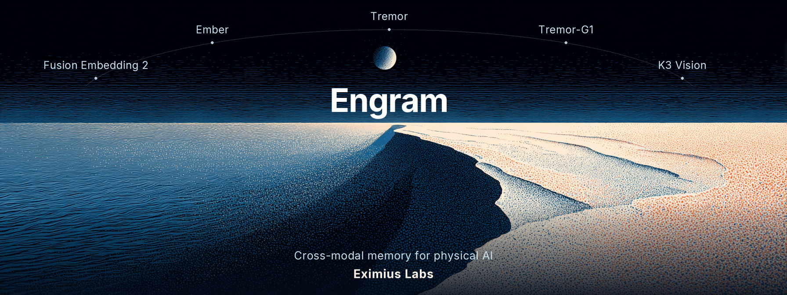

<div align="center">



**The open cross-modal memory layer for physical AI.**

*Index a robot's video, audio, and motion into one embedding space, then search and reason
about it in plain language, including temporal reasoning that retrieval alone cannot do.*

[](https://pypi.org/project/engram-robomem/)
[](#)
[](LICENSE)
[](#)
[](https://www.eximiuslabs.com/playground)

</div>

---

Engram indexes everything a robot sees, hears, and feels into one embedding space on a shared
clock, and answers questions about it in plain language. It goes past retrieval: it reasons about
*when* things happened, not just *what* happened, with deterministic temporal operators that pure
similarity search cannot answer.

It is built on the [Fusion Embedding](https://huggingface.co/EximiusLabs) family (a unified
text / image / video / audio / motion space) but stays model-agnostic: it takes an embedder
through a small injected interface, so the whole ingest, index, and recall path runs with no model,
no GPU, and no network in tests.

> Try a real robot's memory in the [live playground](https://www.eximiuslabs.com/playground). The
> package installs as `engram-robomem` and imports as `robomem`.

## What it does

Give it a recorded multimodal session (timestamped events from a robot's sensors) and it will:

1. **Index** it: group events by modality, embed each window with the injected embedder, segment
   the stream into episodes, score salience, and write one row per window into a local LanceDB
   table on a shared clock.
2. **Recall** by natural language, across modalities: `mem.recall("someone handed me a red mug")`,
   or query by example (hand it any stored vector, get the nearest windows of another modality).
3. **Reason about time**, which is the part retrieval cannot do:
   - `mem.last("shaking violently")` returns the most recent matching moment.
   - `mem.count("a person shouting")` counts distinct occurrences.
   - `mem.before(anchor="the alarm")` finds what came just before an event.
   - `mem.timeline()` returns an ordered chronological index.

Because motion is a first-class modality, Engram answers questions no camera can, such as "when was
it last shaken," straight from the accelerometer with no video in the result.

The full suite is GPU-free and validated on real data: Ego4D human egocentric recordings and a real
Unitree humanoid shift, not only synthetic sessions.

## Quickstart (CPU, no model)

```python
from robomem import RobotMemory, FakeEmbedder

session = [
    {"id": "img_dog", "t": 1.0, "modality": "image", "path_or_data": "cam0/dog_01.png", "source": "cam0"},
    {"id": "aud_bark", "t": 1.2, "duration": 0.5, "modality": "audio", "path_or_data": "mic0/bark.wav", "source": "mic0"},
    {"id": "mot_shake", "t": 4.0, "modality": "motion", "path_or_data": {"data": [[0.1, 0.2, 0.3]], "sr": 30}, "source": "imu"},
]

mem = RobotMemory.open("./session.lancedb", embedder=FakeEmbedder())
mem.index(session, segment=True)                 # populates episodes + salience

hits = mem.recall("a dog", modality="image", k=5)
last_shake = mem.last("shaking", modality="motion")
n_barks = mem.count("a dog barking", modality="audio")
```

## Wiring in the real embedder

```python
from fusion_embedding.unified import UnifiedEmbedder
from robomem import RobotMemory

embedder = UnifiedEmbedder.from_pretrained(
    "EximiusLabs/fusion-embedding-2-2b-preview", device="cuda", revision="v0.3-preview",
)
mem = RobotMemory.open("./session.lancedb", embedder=embedder)
mem.index("session.jsonl", segment=True)
hits = mem.recall("someone handed me a red mug", k=10, after=120.0, before=180.0)
```

Install with `pip install engram-robomem` (imports as `robomem`). The base package needs only
LanceDB, numpy, and Pillow. The real embedder (`fusion_embedding`) is not on PyPI yet, so install it
from source:

```
pip install "fusion_embedding @ git+https://github.com/Eximius-Labs/fusion-embedding"
```

## Design: dependency injection at the embedder seam

Engram never builds an embedder. It takes one that implements the `embed_*` protocol
(`robomem.embedder.Embedder`):

```
embed_text  embed_image  embed_video  embed_audio  embed_thermal  embed_motion  embed_geometry
center      rank_cross_modal
```

Every `embed_*` returns a full-width, L2-normalized vector. In production that object is the trained
`UnifiedEmbedder`; in tests it is `FakeEmbedder`, a deterministic CPU stand-in. This keeps the whole
pipeline runnable with no model, no GPU, and no network, following the model core's own "DI at the
seams plus tiny CPU stand-ins" discipline.

## Session manifest

A session is a JSONL file, a JSON array, or an in-memory list of events:

```json
{"t": 12.5, "modality": "image", "path_or_data": "cam0/frame_00012.png", "source": "cam0"}
{"t": 12.5, "modality": "audio", "path_or_data": "mic0/clip_012.wav", "source": "mic0", "duration": 1.0}
{"t": 13.0, "modality": "text",  "path_or_data": "operator said stop", "source": "log"}
```

Required per event: `t` (or `t_start`), `modality`, and `path_or_data`. Optional: `id`, `source`,
`duration` (or `t_end`), `meta`, `thumb`. `modality` is one of
`text | image | video | audio | thermal | motion | geometry`. For image, video, thermal, geometry,
and audio, `path_or_data` is normally a path the embedder loads itself; audio and motion may also be
passed as `{"data": [...], "sr": 16000}`.

## CLI

```
robomem index <manifest> --db <path> [--dedup-tau 0.98] [--fake]
robomem query "<text>" --db <path> [--modality image] [-k 10] [--after 10 --before 30] [--fake]
robomem show <event_id> --db <path> [--fake]
```

`--fake` uses the CPU stand-in embedder. Without it, the CLI loads
`UnifiedEmbedder.from_pretrained(--model, device=--device)`.

## Data model (Tier-0 `events` table)

| column | type | note |
| --- | --- | --- |
| `event_id` | string | unique |
| `t_start`, `t_end` | float64 | window time bounds (seconds) |
| `modality` | string | text / image / video / audio / thermal / motion / geometry |
| `source` | string | stream key (camera / mic / channel) |
| `vector` | list<float32>[2048] | full-width, L2-normalized unified embedding |
| `thumb`, `meta` | string | preview path, JSON metadata |
| `episode_id`, `salience` | string, float32 | episode assignment and novelty score |

## How recall and reasoning work

`recall` embeds the query, applies a LanceDB SQL prefilter on time and modality, scores an exact
cosine scan over the candidates (session scale, no ANN index), optionally mean-centers per modality
to correct the cross-modal gap, merges temporally adjacent same-source hits into segments, and
ranks. `recall_like` is the same path starting from a supplied vector.

Episode segmentation runs an online change-point over each stream's embedding sequence; salience
scores per-window novelty. The temporal operators (`last`, `count`, `before`, `after`, `timeline`)
are deterministic programs over the LanceDB time filter plus relevance and episode grouping, with
no LLM in the loop. Ranking can weight relevance, recency, and salience together, so a "last" query
returns the most recent match rather than the most similar one.

## Development

```
uv venv --system-site-packages
uv pip install lancedb pyarrow pillow pytest
uv run python -m pytest
```

The suite is GPU-free and uses `FakeEmbedder` with small synthetic sessions.

## License

Apache-2.0. See [LICENSE](LICENSE).
